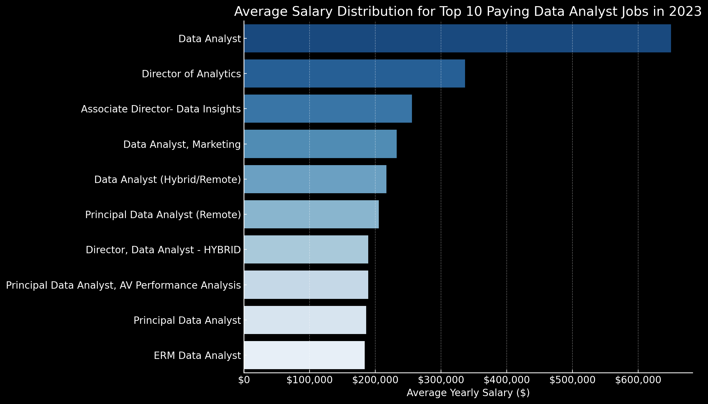

# Introduction
📊 Explore the data job market with a focus on data analyst roles. This project analyzes 💰 top-paying roles, 🔥 in-demand skills, and 📈 areas where high demand aligns with high salaries in data analytics.

🔍 Want to see the SQL queries? [Check them out here](/project_sql/)

# Background
This project explores the data analyst job market to identify top-paying roles and in-demand skills. The goal is to make it easier for others to find better job opportunities, faster.

The data comes from [SQL Course](https://lukebarousse.com/sql), built on job postings he scraped and parsed from multiple sources. It includes job titles, salaries, locations, and key skills.

### The questions I wanted to answer through my SQL queries were:

1. What are the top-paying data analyst jobs?
2. What skills are required for these top-paying jobs?
3. What skills are most in demand for data analysts?
4. Which skills are associated with higher salaries?
5. What are the most optimal skills to learn?

# Tools Used
For my deep dive into the data analyst job market, I harnessed the power of several key tools:

- **SQL** — Core tool for querying the database and extracting insights.
- **PostgreSQL** — Used to store and manage the job postings data.
- **Visual Studio Code** — For writing and running SQL queries.
- **Git & GitHub** — For version control and sharing the project.

# SQL-Driven Analysis
Each query in this project was designed to answer a specific question about the data analyst job market. Here's how I approached them:

### 1. Top Paying Data Analyst Jobs

To identify the highest-paying roles, I filtered data analyst positions by average yearly salary and location, focusing on remote jobs. This query highlights the high-paying opportunities in the field.

```sql
SELECT
    job_id,
    job_title,
    job_location,
    job_schedule_type,
    salary_year_avg,
    job_posted_date,
    name AS company_name
FROM
    job_postings_fact
LEFT JOIN company_dim
    ON job_postings_fact.company_id = company_dim.company_id
WHERE
    job_title_short = 'Data Analyst'
    AND
    salary_year_avg IS NOT NULL
    AND
    job_location = 'Anywhere'
ORDER BY 
    salary_year_avg DESC
LIMIT 10;
```
Here's the breakdown of the top data analyst jobs in 2023:
- **Salary Range:** The top 10 remote roles range from $184K to $650K — a clear sign of strong earning potential.
- **Employers:** High-paying jobs come from companies like SmartAsset, Meta, and AT&T—spanning multiple industries.
- **Job Title Variety:** Roles range from Data Analyst to Director of Analytics, highlighting the range of specializations in the field.


*Bar chart showing the top 10 highest-paying data analyst roles, based on results from my SQL queries.*

### 2. Skills for Top Paying Jobs

To find out which skills matter most for top-paying roles, I joined job postings with the skills data. This helped identify what employers look for in high-compensation positions.

```sql
WITH top_paying_jobs AS (
    SELECT
        job_id,
        job_title,
        salary_year_avg,
        name AS company_name
    FROM
        job_postings_fact
    LEFT JOIN company_dim
        ON job_postings_fact.company_id = company_dim.company_id
    WHERE
        job_title_short = 'Data Analyst'
        AND
        salary_year_avg IS NOT NULL
        AND
        job_location = 'Anywhere'

    ORDER BY 
        salary_year_avg DESC
    LIMIT 10
)

SELECT
    top_paying_jobs.*,
    skills.skills
FROM
     top_paying_jobs
INNER JOIN skills_job_dim AS skill_to_job
    ON top_paying_jobs.job_id = skill_to_job.job_id
INNER JOIN skills_dim AS skills
    ON skill_to_job.skill_id = skills.skill_id
ORDER BY 
    salary_year_avg DESC
```
### Top Skills for High-Paying Data Analyst Roles
1. **SQL** – The most required skill, showing up in over 25% of top-paying job listings.  
2. **Python** – A close second, highlighting its importance in data-heavy roles.  
3. **Tableau** – Emphasizes the need for strong data visualization skills.  
4. **Snowflake, Pandas, Excel** – These tools show that practical data wrangling and analysis are still essential.  
5. **Go, NumPy** – Point to demand for backend performance and numerical computing in certain roles.

### Skill Trends

- High-paying roles value a mix of **data engineering** (SQL, Snowflake), **analysis** (Excel, Tableau, Pandas), and **programming** (Python, R, Go).
- Experience with **version control and DevOps tools** (e.g., GitLab) also appears in several listings, suggesting production-level expectations.


*Bar chart showing the most common skills across the top 10 highest-paying data analyst roles.*

### 3. In-Demand Skills for Data Analysts

This query identified the most frequently requested skills in job postings, highlighting which areas are most in demand.

```sql
SELECT
    s.skills,
    COUNT(stj.job_id) AS skill_count
FROM
    job_postings_fact AS jp
INNER JOIN skills_job_dim AS stj
    ON jp.job_id = stj.job_id
INNER JOIN skills_dim AS s
    ON stj.skill_id = s.skill_id
WHERE
    jp.job_title_short = 'Data Analyst'
GROUP BY
    s.skills
ORDER BY
    skill_count DESC
LIMIT 5
```
Here's the breakdown of the most in-demand skills for data analysts in 2023.
- **SQL** and **Excel** are still core skills, showing the importance of strong data processing and spreadsheet abilities.  
- **Python**, **Tableau**, and **Power BI** reflect the growing need for programming and data visualization in supporting decisions and telling data-driven stories.

| Skills   | Demand Count |
|----------|--------------|
| SQL      | 7291         |
| Excel    | 4611         |
| Python   | 4330         |
| Tableau  | 3745         |
| Power BI | 2609         |

*Table showing the demand for the top 5 skills in data analyst job postings.*

### 4. Skills Based on Salary

This analysis looked at average salaries by skill to identify which ones are linked to higher-paying roles.

```sql
SELECT
    s.skills AS skill,
    ROUND(AVG(jp.salary_year_avg), 2) AS avg_salary
FROM job_postings_fact as jp
INNER JOIN skills_job_dim AS stj
    ON jp.job_id = stj.job_id
INNER JOIN skills_dim AS s
    ON stj.skill_id = s.skill_id
WHERE
    jp.job_title_short = 'Data Analyst'
    AND
    jp.salary_year_avg IS NOT NULL
GROUP BY
    s.skills
ORDER BY
    avg_salary DESC
LIMIT 10
```
Here's a breakdown of the results for top paying skills for Data Analysts:
- **Blockchain & Web3:** Solidity, smart contracts
- **DevOps & Automation:** SVN, GitLab, CI/CD tools
- **Big Data & Databases:** Couchbase, Snowflake, NoSQL
- **Machine Learning:** MXNet, ML automation tools
- **Systems & Backend:** Golang, low-level performance tools
- **Core Tools (Widespread, Lower Pay):** SQL, Python, Excel — essential but more common

*Rare or niche skills often lead to higher salaries.*

| Skills        | Average Salary ($) |
|---------------|-------------------:|
| pyspark       |            208,172 |
| bitbucket     |            189,155 |
| couchbase     |            160,515 |
| watson        |            160,515 |
| datarobot     |            155,486 |
| gitlab        |            154,500 |
| swift         |            153,750 |
| jupyter       |            152,777 |
| pandas        |            151,821 |
| elasticsearch |            145,000 |

*Table showing the average salary for the top 10 highest-paying skills in data analyst roles.*

### 5. Most Optimal Skills to Learn

This query combined demand and salary data to highlight skills that are both in high demand and well-paid — a useful guide for prioritizing skill development.

```sql
SELECT
    s.skill_id,
    s.skills AS skill,
    COUNT(stj.job_id) AS skill_count,
    ROUND(AVG(jp.salary_year_avg), 2) AS avg_salary
FROM
    job_postings_fact AS jp
INNER JOIN skills_job_dim AS stj
    ON jp.job_id = stj.job_id
INNER JOIN skills_dim AS s
    ON stj.skill_id = s.skill_id
WHERE
    jp.job_title_short = 'Data Analyst'
    AND
    jp.salary_year_avg IS NOT NULL
    AND
    jp.job_work_from_home IS TRUE
GROUP BY
    s.skill_id
HAVING
    COUNT(stj.job_id) > 10
ORDER BY
    avg_salary DESC,
    skill_count DESC
```

| Skill ID | Skills     | Demand Count | Average Salary ($) |
|----------|------------|--------------|-------------------:|
| 8        | go         | 27           |            115,320 |
| 234      | confluence | 11           |            114,210 |
| 97       | hadoop     | 22           |            113,193 |
| 80       | snowflake  | 37           |            112,948 |
| 74       | azure      | 34           |            111,225 |
| 77       | bigquery   | 13           |            109,654 |
| 76       | aws        | 32           |            108,317 |
| 4        | java       | 17           |            106,906 |
| 194      | ssis       | 12           |            106,683 |
| 233      | jira       | 20           |            104,918 |

*Table showing the most optimal skills for data analysts, sorted by average salary.*

Here's a breakdown of the most optimal skills for Data Analysts in 2023: 
- **High-Demand Programming Languages:**  
  Python (236) and R (148) lead in demand, with average salaries around $101K. They're essential but widely known, which keeps salaries relatively stable.

- **Cloud Tools & Big Data Technologies:**  
  Snowflake, Azure, AWS, and BigQuery are in demand and offer strong salaries — reflecting the shift toward cloud-based data platforms.

- **BI & Visualization Tools:**  
  Tableau (230) and Looker (49) show that data storytelling and dashboarding are still key, with salaries around $99K–$104K.

- **Database Tech (Traditional & NoSQL):**  
  Skills in Oracle, SQL Server, and NoSQL remain highly relevant, offering solid pay and forming the foundation of most analytics workflows.

# What I Learned

This project was a solid SQL refresher. I already knew most of the concepts, but it helped me brush up on the essentials before moving on to the intermediate course from the same creator:

- **🧩 Query Structuring:** Revisited how to merge tables, use `WITH` clauses, and structure clean, readable queries.  
- **📊 Aggregation Basics:** Got back into the flow with `GROUP BY`, `COUNT()`, `AVG()`, and other core functions.  
- **💡 Applied Practice:** Used real job market data to sharpen my thinking and turn questions into meaningful SQL queries.

# Conclusions

### Insights
From the analysis, several general insights emerged:
1. **Top-Paying Roles:** Remote data analyst jobs can pay up to $650,000, with a wide salary range across top positions.  
2. **Key Skill for High Pay:** SQL stands out as the top skill in high-paying roles, reinforcing its value for career growth.  
3. **Most In-Demand Skill:** SQL also leads in demand, making it a must-have for anyone entering the field.  
4. **Specialized Skills = Higher Pay:** Niche tools like SVN and Solidity are linked to the highest average salaries, showing the value of specialized expertise.  
5. **Best Overall Skill:** SQL offers both high demand and strong salary potential — making it one of the most valuable skills to focus on.

### Closing Thoughts

This project helped me refresh my SQL skills and dig into real data on the data analyst job market. The analysis points to where it makes sense to focus — both in terms of skill development and job search. For anyone getting into the field, aiming for high-demand, high-paying skills is a smart move. The key takeaway: keep learning and stay updated with trends in data analytics ✨.